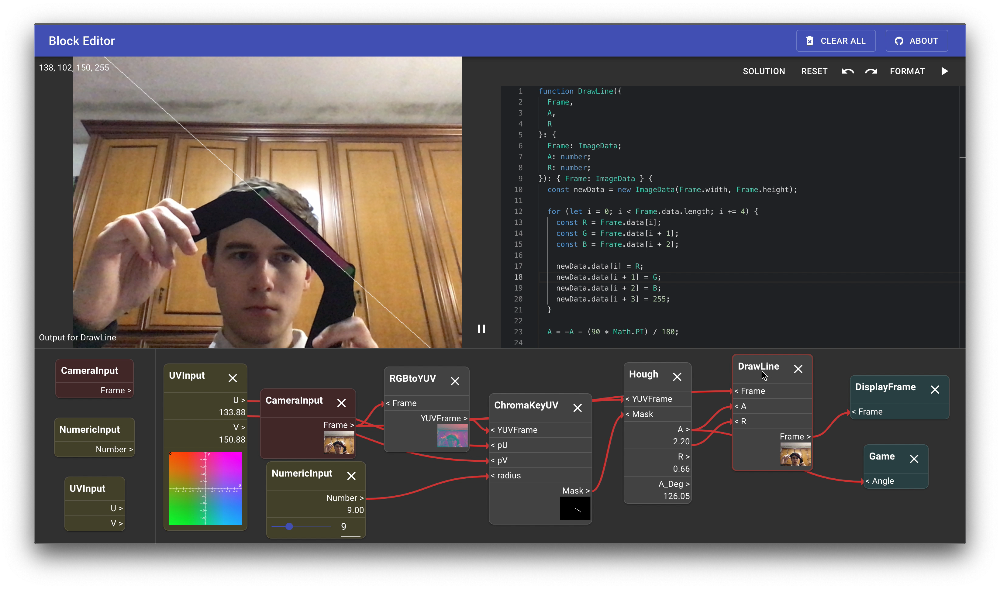

# cvedu

A small React web application to be used to teach principles of Computer Vision, using your webcam, Typescript and a block–based visual editor.

Every block represents a **pure function**, that can process data. You can connect the blocks inputs and outputs dragging them. To delete a connection, simply double–click them.
If you select a block, you can **see its output** and **edit the code**, using the included code editor.

You can easily build a line detector, and play the **included game** with a colored joystick.

A video demonstration is below:

**\*NOTE:** This was built as a side project, to be used specifically for a course taught at my university, it may be unstable or incomplete, and it's still in heavy development. I take no responsability for its usage.\*

## Available Scripts

In the project directory, you can run:

### `yarn start`

Runs the app in the development mode. 
Open [http://localhost:3000](http://localhost:3000) to view it in the browser.

The page will reload if you make edits. 
You will also see any lint errors in the console.

### `yarn build`

Builds the app for production to the `build` folder. 
It correctly bundles React in production mode and optimizes the build for the best performance.

The build is minified and the filenames include the hashes. 
Your app is ready to be deployed!

See the section about [deployment](https://facebook.github.io/create-react-app/docs/deployment) for more information.
